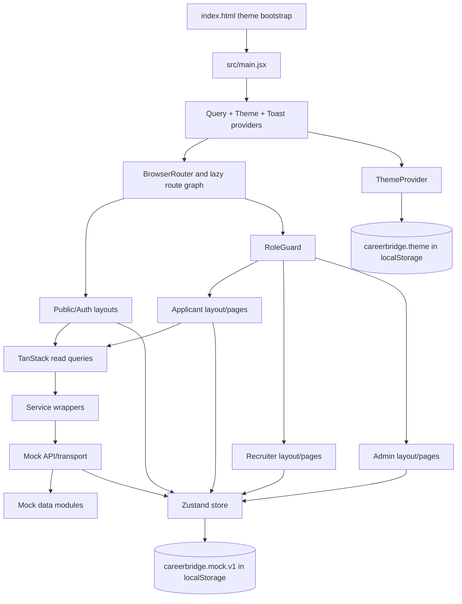

# CareerBridge Frontend Architecture

## 1. Purpose and scope

CareerBridge is a frontend-only off-campus recruitment portal prototype for three user roles:

- applicants discover jobs and companies, maintain a profile, save roles, apply, and track applications;
- recruiters publish and manage jobs, review candidates, move them through a hiring pipeline, record notes, and maintain a company profile;
- administrators review fictional companies, job listings, and user accounts through moderation controls.

This document describes the implementation that exists in this repository. The application uses seeded data, simulated asynchronous services, and browser-local persistence. It does not contain a backend, database, real file upload, email delivery, identity provider, or production AI integration.

## 2. Technology stack and dependency usage

### Runtime and build tooling

| Technology | Version/configuration | Actual use |
| --- | --- | --- |
| React | `19.2.6` | Component rendering, hooks, context, lazy route modules, and `StrictMode`. |
| React DOM | `19.2.6` | Creates the root in `src/main.jsx`. |
| Vite | `8.0.13` | Development server and production build. `vite.config.js` registers React, Tailwind/PostCSS, Sites, and the `@` root alias. |
| JavaScript/JSX | ESM via `"type": "module"` | All application source is JavaScript/JSX; there is no TypeScript application source. |
| Tailwind CSS | `4.2.1` | Utility-first styling and CSS-variable-backed theme tokens in `src/styles/globals.css`. |
| Oxlint / Oxfmt | `1.76.0` / `0.61.0` | `npm run lint` checks `src`; `npm run format` formats the repository. There is no `eslint.config.js` and no ESLint script. |
| Vitest / Testing Library | Vitest `4.0.18`, jsdom, React Testing Library | Unit and interaction tests configured by `vitest.config.js` and `src/test/setup.js`. |

### Application libraries

| Dependency | Actual use |
| --- | --- |
| `react-router-dom` | `BrowserRouter`, nested layouts, lazy route elements, links, URL search parameters, dynamic parameters, redirects, and role guards. |
| `@tanstack/react-query` | Provides `QueryClientProvider` and six page-level read-query patterns for jobs, companies, and applicant notifications. Defaults: 30-second stale time and one retry. |
| `zustand` | One persisted application store for session and all locally mutable applicant, recruiter, and admin workflows. |
| `react-hook-form`, `@hookform/resolvers`, `zod` | Login, role signup, and the recruiter job form. The job form has a centralized Zod schema; login/signup schemas are page-local. |
| `@base-ui/react` | Accessible button and dialog primitives underpin `Button`, `Modal`, and `Drawer`. |
| `class-variance-authority` | Declares button variants and sizes. |
| `clsx`, `tailwind-merge` | Combined by `src/lib/utils.js` as the shared `cn()` class utility. |
| `lucide-react` | Icon system across navigation, forms, cards, feedback, dashboards, and actions. |
| `@fontsource/inter`, `@fontsource/manrope` | Locally bundled body and heading font weights imported by `src/main.jsx`. |
| `tw-animate-css`, `shadcn/tailwind.css` | Imported by the global stylesheet. |

The following declared runtime dependencies have no imports in current application source: `@shadcn/react`, `cmdk`, `date-fns`, `embla-carousel-react`, `input-otp`, `react-day-picker`, `react-resizable-panels`, and `recharts`. The `shadcn` package is also installed, while `components.json` records shadcn-compatible aliases and the `base-nova` style; the checked-in primitives are custom source files rather than generated imports from `@shadcn/react`.

## 3. Repository structure

```text
Career Bridge Full Stack App/
├── components.json                 # shadcn-compatible component metadata
├── index.html                      # root element, metadata, favicon, pre-render theme bootstrap
├── package.json                    # scripts, engines, runtime and development dependencies
├── package-lock.json
├── README.md                       # product summary, local setup, demo accounts
├── vite.config.js                  # React/Tailwind/Sites plugins and @ alias
├── vitest.config.js                # jsdom tests and shared setup
├── public/
│   ├── favicon.svg
│   └── og.png
├── scripts/
│   └── prepare-sites-worker.mjs    # post-build artifact preparation
└── src/
    ├── main.jsx                    # browser entry point
    ├── app/
    │   ├── App.jsx                 # lazy route graph
    │   └── providers.jsx           # query, theme, and toast providers
    ├── components/
    │   ├── applications/           # status badge and application timeline
    │   ├── auth/                   # role guard
    │   ├── brand/                  # logo and bridge mark
    │   ├── candidates/             # candidate match explanation dialog
    │   ├── companies/              # company cards and filters
    │   ├── feedback/               # route loading and toast context
    │   ├── jobs/                   # cards, search, filters, metadata, match, sharing
    │   ├── navigation/             # public/applicant/recruiter/admin navigation
    │   ├── notifications/          # applicant notification popover
    │   └── ui/                     # reusable UI primitives
    ├── data/
    │   ├── mockData.js             # public, applicant, and recruiter fixtures
    │   └── adminData.js            # admin review fixtures
    ├── domain/constants.js         # roles, statuses, filters, demo accounts
    ├── features/theme/             # theme context and persistence
    ├── hooks/useDocumentTitle.js   # route-specific document titles
    ├── layouts/                    # public, auth, applicant, recruiter, admin shells
    ├── lib/                        # class merging, URL facets, job formatting
    ├── pages/
    │   ├── public/
    │   ├── auth/
    │   ├── applicant/
    │   ├── recruiter/
    │   └── admin/
    ├── schemas/jobSchema.js        # recruiter job validation and step fields
    ├── services/                   # async mock boundaries, query keys, matching
    ├── store/useAppStore.js        # persisted Zustand state and actions
    ├── styles/globals.css          # Tailwind imports, tokens, global utilities
    └── test/                       # shared test renderer and jsdom setup
```

There is no `eslint.config.js`, backend directory, API server, database schema, or server-side authentication code.

## 4. Startup and provider sequence

1. `index.html` defines `#root`, loads `/src/main.jsx`, provides static metadata, and applies the saved/system theme before React renders to reduce theme flashing.
2. `src/main.jsx` imports the selected Inter and Manrope font weights plus `src/styles/globals.css`.
3. React creates the root inside `StrictMode`.
4. `AppProviders` creates one stable `QueryClient`, then nests `QueryClientProvider` → `ThemeProvider` → `ToastProvider`.
5. `BrowserRouter` supplies browser-history routing.
6. `App` renders nested `Routes` inside one `Suspense` boundary. Every route module except `PublicLayout` and `RoleGuard` is lazy-loaded; `RouteLoading` supplies the fallback.
7. A matched layout renders navigation and an `Outlet`; guarded workspaces first read the current persisted session and either render or redirect.

## 5. Route architecture

### Public routes

| Route | Module | Layout | Parameters / behavior |
| --- | --- | --- | --- |
| `/` | `src/pages/public/HomePage.jsx` | `PublicLayout` | Index route. |
| `/jobs` | `src/pages/public/JobsPage.jsx` | `PublicLayout` | Query string holds keyword, location, experience, eight repeated facet keys, and `datePosted`. |
| `/jobs/:jobId` | `src/pages/public/JobDetailPage.jsx` | `PublicLayout` | Reads `jobId`; optional router state preserves a `/jobs...` return URL. |
| `/companies` | `src/pages/public/CompaniesPage.jsx` | `PublicLayout` | Component-local search and company filters. |
| `/companies/:companyId` | `src/pages/public/CompanyDetailPage.jsx` | `PublicLayout` | Reads `companyId`. |
| `/resources` | `src/pages/public/ResourcesPage.jsx` | `PublicLayout` | Static seeded guides. |
| `/404` | `src/pages/public/NotFoundPage.jsx` | `PublicLayout` | Explicit not-found page. |
| `*` | `src/pages/public/NotFoundPage.jsx` | `PublicLayout` | Catch-all renders the same 404 content without rewriting the URL. |

### Authentication routes

| Route | Module | Layout | Behavior |
| --- | --- | --- | --- |
| `/login` | `src/pages/auth/LoginPage.jsx` | `AuthLayout` | Supports `?redirect=...`; only applicant login honors that requested path. Other roles go to their dashboard. |
| `/signup` | `src/pages/auth/SignupPage.jsx` | `AuthLayout` | Role selection. |
| `/signup/applicant` | `src/pages/auth/RoleSignupPage.jsx` | `AuthLayout` | `accountType="applicant"`. |
| `/signup/recruiter` | `src/pages/auth/RoleSignupPage.jsx` | `AuthLayout` | `accountType="recruiter"`. |
| `/forgot-password` | `src/pages/auth/ForgotPasswordPage.jsx` | `AuthLayout` | Simulated recovery confirmation. |

### Applicant routes

All applicant routes use `RoleGuard allowedRole="applicant"` and `ApplicantLayout`.

| Route | Module | Parameter |
| --- | --- | --- |
| `/applicant/dashboard` | `src/pages/applicant/ApplicantDashboardPage.jsx` | — |
| `/applicant/saved-jobs` | `src/pages/applicant/SavedJobsPage.jsx` | — |
| `/applicant/applications` | `src/pages/applicant/ApplicationsPage.jsx` | — |
| `/applicant/applications/:applicationId` | `src/pages/applicant/ApplicationDetailPage.jsx` | `applicationId` |
| `/applicant/profile` | `src/pages/applicant/ProfilePage.jsx` | — |
| `/applicant/notifications` | `src/pages/applicant/ApplicantNotificationsPage.jsx` | — |
| `/applicant/settings` | `src/pages/applicant/ApplicantSettingsPage.jsx` | — |

### Recruiter routes

All recruiter routes use `RoleGuard allowedRole="recruiter"` and `RecruiterLayout`.

| Route | Module | Parameter / mode |
| --- | --- | --- |
| `/recruiter/dashboard` | `src/pages/recruiter/RecruiterDashboardPage.jsx` | — |
| `/recruiter/jobs` | `src/pages/recruiter/RecruiterJobsPage.jsx` | — |
| `/recruiter/jobs/new` | `src/pages/recruiter/JobFormPage.jsx` | Create mode. |
| `/recruiter/jobs/:jobId/edit` | `src/pages/recruiter/JobFormPage.jsx` | Edit seeded or locally saved job. |
| `/recruiter/jobs/:jobId/applicants` | `src/pages/recruiter/CandidatePipelinePage.jsx` | Candidate list for `jobId`. |
| `/recruiter/candidates/:applicationId` | `src/pages/recruiter/CandidateDetailPage.jsx` | Candidate application detail. |
| `/recruiter/company` | `src/pages/recruiter/RecruiterCompanyPage.jsx` | — |
| `/recruiter/notifications` | `src/pages/recruiter/RecruiterNotificationsPage.jsx` | — |
| `/recruiter/settings` | `src/pages/recruiter/RecruiterSettingsPage.jsx` | — |

### Admin routes

All admin routes use `RoleGuard allowedRole="admin"` and `AdminLayout`.

| Route | Module |
| --- | --- |
| `/admin/dashboard` | `src/pages/admin/AdminDashboardPage.jsx` |
| `/admin/companies` | `src/pages/admin/AdminCompaniesPage.jsx` |
| `/admin/jobs` | `src/pages/admin/AdminJobsPage.jsx` |
| `/admin/users` | `src/pages/admin/AdminUsersPage.jsx` |

`RoleGuard` redirects signed-out visitors to `/login?redirect=<pathname+search>`. A signed-in user entering another role's area is redirected to their own dashboard. There are no nested index redirects for bare `/applicant`, `/recruiter`, or `/admin`; these unmatched paths reach the public catch-all.

## 6. Layout and navigation architecture

| Layout | Structure and navigation behavior |
| --- | --- |
| `PublicLayout.jsx` | Sticky `PublicNavbar`, main outlet, `PublicFooter`, and a skip link. Desktop navigation links to jobs, companies, and resources; mobile navigation uses a Base UI drawer. Login, signup, theme control, employer links, and homepage anchors complete the shell. |
| `AuthLayout.jsx` | Two-column desktop presentation with a branded benefits panel and form outlet; mobile hides the promotional panel. Header exposes logo, home return, and theme control. |
| `ApplicantLayout.jsx` | Sticky `ApplicantNavbar`, skip link, and a 1360px application container. The navbar links to public discovery plus applications and offers account links, notifications, search, logout, theme control, and a mobile drawer. |
| `RecruiterLayout.jsx` | Fixed 244px desktop sidebar and sticky contextual header. Mobile uses a drawer. The sidebar links to overview, jobs, a seeded candidate pipeline, company profile, notifications, settings/help, posting, and logout. |
| `AdminLayout.jsx` | Fixed 232px desktop sidebar and sticky contextual header; a controlled mobile drawer closes after navigation. Links cover dashboard and the three moderation areas. |

Navigation is route-first rather than configuration-generated globally: each role has its own local nav-item array. All logout handlers clear only `session`, preserve other local demo data, and navigate to `/` with replacement.

## 7. Page architecture

### Public experience

| Page | Purpose and sections | State/data and interactions | Feedback/navigation |
| --- | --- | --- | --- |
| `HomePage.jsx` (`/`) | Hero search, browse chips, featured jobs, hiring companies, product principles, candidate flow, recruiter CTA, and resources. | Directly reads seeded jobs, companies, resources; reads saved IDs and toggles saves from Zustand. | Links to searches, job/company detail, resources, signup, and profile. No async state. |
| `JobsPage.jsx` (`/jobs`) | Search header, responsive filters, selected chips, sortable results, and pagination (six per page). | URL-backed keyword/location/experience/facets; local sort/page/facet state; `jobsService.getJobs`; optional applicant match sorting; persisted save toggles. | Skeleton cards, retryable error state, filtered empty state, desktop sticky filters, bottom mobile filter drawer. Job links carry the current URL in route state. |
| `JobDetailPage.jsx` (`/jobs/:jobId`) | Job identity/metadata, summary, responsibilities, skills, eligibility, company preview, match guidance, and application action panel. | Job query; local modal, note, and consent state; persisted session, profile, saves, applications; deterministic match score. Apply/save writes directly to Zustand and uses toasts. | Loading skeleton, unavailable state, duplicate-application toast, login redirect, submitted state, desktop sticky actions, mobile fixed actions, clipboard/share control. |
| `CompaniesPage.jsx` (`/companies`) | Company discovery header, search, four facets, and card grid. | Companies query; local search and filters; memoized filtering. | Skeleton grid, retryable error, clearable empty state; cards navigate to detail. |
| `CompanyDetailPage.jsx` (`/companies/:companyId`) | Company header and Overview, Open jobs, Culture & benefits tabs. | Company query followed by enabled all-jobs query; local active tab; persisted saves. Jobs are filtered client-side by company ID. | Company loading/not-found states; job loading/empty states; back link and job cards. |
| `ResourcesPage.jsx` (`/resources`) | Resource hero, six seeded guide cards, and a four-step weekly toolkit. | Direct static fixture data; no mutable state. | Links back to jobs; guide cards are presentational and do not have individual guide routes. |
| `NotFoundPage.jsx` (`/404`, `*`) | Branded 404 explanation. | No state. | Links home or to job discovery. |

### Authentication experience

| Page | Form/state | Validation and outcome |
| --- | --- | --- |
| `LoginPage.jsx` (`/login`) | React Hook Form fields for email, password, remember-me; local password visibility and server error; demo credential-fill buttons. | Page-local Zod schema validates email, 8-character password, and boolean. `authService.login` recognizes three hardcoded demo accounts, writes session, and redirects. Invalid credentials show an alert. Remember-me is collected but does not alter persistence. |
| `SignupPage.jsx` (`/signup`) | Stateless role-choice cards. | Links to applicant or recruiter signup. Admin signup is not implemented. |
| `RoleSignupPage.jsx` (`/signup/applicant`, `/signup/recruiter`) | React Hook Form for name, optional company, email, password confirmation, and terms. | Dynamic Zod refinements validate matching passwords, terms, and recruiter company name. A timer simulates account creation, writes a local session, shows completion, and redirects. Created identity is not stored as a user record. |
| `ForgotPasswordPage.jsx` (`/forgot-password`) | Controlled email and sent flag. | Native email requirement plus a simple `includes('@')` check. It only renders a simulated sent state; no recovery service exists. |

### Applicant experience

| Page | Purpose and sections | State/data and interactions | States |
| --- | --- | --- | --- |
| `ApplicantDashboardPage.jsx` | Greeting/search, profile completion, recommendations, application metrics/recent activity, saved roles, match-improvement prompt. | Direct fixtures plus persisted session, profile, applications, saved IDs; local match calculations; save toggles. | Assumes seeded content; no dedicated empty/error branch for each dashboard section. |
| `SavedJobsPage.jsx` | Searchable, sortable saved-role collection. | Local search/sort; fixtures joined to persisted saved IDs; unsave via `JobCard`. | Distinct no-saves and no-search-results states. |
| `ApplicationsPage.jsx` | Status tabs, search, responsive applications table/cards. | Local tab/search; persisted applications joined to fixture jobs and companies; latest-update ordering. | Empty state for the current filter/search. |
| `ApplicationDetailPage.jsx` | Job/company header, current status, application timeline, recruiter updates, submission summary, cover note, and contact/help actions. | Route parameter selects one persisted application, joined with fixture job/company data. | Application-not-found state with return link; empty recruiter-update copy when only submission exists. |
| `ProfilePage.jsx` | Basic identity, summary, skills, education, projects, experience, certifications, resume, preferences, completion guidance. | Persisted profile; local edit/extraction modals, basic form, skill input, and file input ref. Basic details and skills are editable; resume stores filename only; extraction adds two simulated skills and completion. | Explicit empty experience panel; no real parsing/upload; several edit/add buttons are presentational only. |
| `ApplicantNotificationsPage.jsx` | All/unread tabs and notification feed. | Applicant notification query plus shared persisted read IDs; direct store actions mark one/all read. | Skeleton, retryable error, caught-up empty state, unread styling. |
| `ApplicantSettingsPage.jsx` | Account display, notification switches, privacy explanation, logout. | Local-only preference toggles; persisted session/logout. | Preferences are not added to the persisted application store and reset on remount. |

### Recruiter experience

| Page | Purpose and sections | State/data and interactions | States |
| --- | --- | --- | --- |
| `RecruiterDashboardPage.jsx` | Hiring metrics, recent candidates, stage distribution, attention notices, active jobs. | Direct fixtures and persisted candidate status overrides; derived counts. | Seed-oriented; no async/error/empty dashboard states. |
| `RecruiterJobsPage.jsx` | Active/draft/closed tabs, search, department and sort controls, responsive management table. | Merges seeded recruiter jobs with persisted drafts and state overrides. Local confirmation modal drives close/reopen/delete actions. | Per-tab empty state; destructive confirmation for close/delete and confirmation for reopen. |
| `JobFormPage.jsx` | Three-step create/edit form: role basics, requirements, review/publish. Includes candidate-facing preview. | React Hook Form + `jobSchema`; route ID loads a seeded/local job; step validation via `jobStepFields`; store saves draft/published representation; toast and navigation after save. | Field errors, step progression, unsaved-change browser warning, submitting/success flags. Publishing is simulated with a timer. |
| `CandidatePipelinePage.jsx` | Job header, multi-facet candidate filters, responsive candidate table, match explanation modal, inline stage changes. | Local search/status/minimum score/experience/location/dialog state; fixture candidates filtered by `jobId`; persisted stage overrides; toast on status change. | Job-not-found and no-candidate-results states. |
| `CandidateDetailPage.jsx` | Candidate identity, summary, skills, education, projects, resume placeholder, match summary, missing evidence, status/history, notes, responsible-review guidance. | Route parameter selects fixture candidate; persisted current status/history/notes; local note text; status and note writes with toasts. | Candidate-not-found state; disabled resume preview explicitly marks unavailable demo behavior. |
| `RecruiterCompanyPage.jsx` | Editable company basics/about/benefits/locations plus live preview and verification notice. | Local draft initialized from persisted company profile; submit normalizes comma-separated lists and persists changes. | Inline saved output; native required/url constraints; verification is explicitly fictional. |
| `RecruiterNotificationsPage.jsx` | All/unread feed and mark-read controls. | Direct fixture notifications plus the same persisted read-ID collection used by applicant notifications. | Caught-up empty state; no async loading/error because it bypasses `notificationsService`. |
| `RecruiterSettingsPage.jsx` | Recruiter identity, notification switches, local-data notice, logout. | Local preference state and persisted session/logout. | Preferences reset on remount; no save operation. |

### Admin experience

| Page | Purpose and sections | State/data and interactions | States |
| --- | --- | --- | --- |
| `AdminDashboardPage.jsx` | Moderation metrics and company/job queues. | Admin fixtures plus persisted company/job/user state maps; derived counts and queue lists. | Seed-oriented; clearly labels data as fictional/local. |
| `AdminCompaniesPage.jsx` | Searchable verification queue with status filter. | Local search/filter; persisted `Pending`, `Verified`, or `Needs changes` decision per fixture company. | No-results state; approve/change actions are immediate and reversible. |
| `AdminJobsPage.jsx` | Searchable moderation queue with state filter. | Local search/filter/modal; persisted `Flagged`, `Expired`, `Cleared`, or `Deactivated` state. | No-results state; deactivation requires a modal, clearing is immediate. |
| `AdminUsersPage.jsx` | Search, role/state filters, account table. | Local filters/modal; persisted `Active`/`Suspended` state. | No-results state; suspend requires a modal; reactivate is immediate. |

## 8. Component architecture

### UI primitives (`src/components/ui`)

- `Button.jsx`: Base UI button with CVA variants `primary`, `secondary`, `soft`, `ghost`, `danger`, `dangerSoft`, `link`, and `hero`; sizes from 34px through 48px plus icon sizes.
- `Badge.jsx`: semantic pill variants for neutral, primary, success, warning, danger, and info.
- `Input.jsx`: shared input, textarea, select, and accessible `FormField` label/helper/error wiring.
- `Modal.jsx` and `Drawer.jsx`: Base UI dialogs with portal, backdrop, labelled title/description, close button, animation, and responsive dimensions.
- `Tabs.jsx`: controlled tab list with roving focus and Arrow/Home/End keyboard support.
- `Feedback.jsx`: skeleton, reusable empty state, and native-progress-based progress bar.
- `Avatar.jsx`, `PageHeader.jsx`, `Pagination.jsx`, `Tooltip.jsx`: initials avatar, page heading pattern, paged navigation, and labelled CSS tooltip wrapper.

### Domain components

- Jobs: `JobCard`, `JobMeta`, `JobSearchBar`, `JobFilterPanel`, `SelectedFilterChips`, `MatchSummary`, `MatchBreakdown`, and `ShareJobButton` own repeated discovery and job-detail behavior.
- Companies: `CompanyCard` and `CompanyFilters` own catalog presentation and filtering controls.
- Applications: `ApplicationStatusBadge` maps applicant statuses to badge variants; `ApplicationTimeline` renders completed/current/future/rejected stages.
- Candidates: `CandidateMatchDialog` explains recruiter-side coverage and missing evidence.
- Authentication: `RoleGuard` is the only authorization gate.
- Feedback: `RouteLoading` renders the lazy-route fallback; `ToastProvider` exposes one transient global toast at a time.
- Branding and navigation: `CareerBridgeLogo`, four navigation systems, theme toggle, footer, and applicant notification menu.

### Important component contracts

| File | Main props | Used by / interaction |
| --- | --- | --- |
| `src/components/jobs/JobCard.jsx` | `job`, `onSave`, `isSaved`, `match`, `detailState` | Home, catalogs, dashboards, saves, and company detail; opens job detail and triggers save with the job ID. |
| `src/components/jobs/JobSearchBar.jsx` | `initialValues`, `compact` | Home, jobs, and applicant dashboard; submits controlled fields into the `/jobs` query string. |
| `src/components/jobs/JobFilterPanel.jsx` | `filters`, `onToggle`, `onDateChange`, `onClear` | Desktop and mobile Jobs page filters. |
| `src/components/jobs/SelectedFilterChips.jsx` | `filters`, `onRemove` | Jobs page; exposes removable representations of active facets. |
| `src/components/jobs/MatchSummary.jsx` | `score`, `label`, `className` | Job cards/detail; presents a bounded percentage. |
| `src/components/jobs/MatchBreakdown.jsx` | `breakdown` | Job detail; explains skill, experience, education, location, and similarity signals. |
| `src/components/companies/CompanyCard.jsx` | `company` | Home and company catalog; navigates to `/companies/:companyId`. |
| `src/components/companies/CompanyFilters.jsx` | `filters`, `onChange`, `onClear` | Company catalog; controlled industry, size, location, and type filters. |
| `src/components/applications/ApplicationTimeline.jsx` | `application` | Application detail; maps the application timeline into visible progression. |
| `src/components/candidates/CandidateMatchDialog.jsx` | `candidate`, `onClose` | Candidate pipeline; renders explainable match evidence in a modal. |
| `src/components/auth/RoleGuard.jsx` | `allowedRole`, `children` | Wraps each protected role layout and performs session/role redirects. |
| `src/components/ui/Modal.jsx` / `Drawer.jsx` | Root-controlled props plus content `title`, `description`, `children` | Application, moderation, profile, candidate, filters, and responsive navigation overlays. |
| `src/components/ui/Tabs.jsx` | `items`, `value`, `onValueChange`, `label`, `className` | Applications, company detail, and applicant notifications; click and keyboard selection. |
| `src/components/ui/Feedback.jsx` | State-specific content/action props | Shared skeleton, empty-result, retry, and progress presentation. |

## 9. Design system

The design system is implemented in `src/styles/globals.css` and utility classes rather than a separate token module.

### Typography

- Body: Inter 400/500/600, with `15px` default size and `1.53` line height.
- Headings: Manrope 600/700/800 via `.font-heading` and Tailwind utilities.
- Headline tracking commonly uses `-0.035em` or `-0.045em`; supporting labels use uppercase tracking around `0.1em–0.12em`.

### Core light-theme tokens

| Token group | Values |
| --- | --- |
| Background/surfaces | `#f6f8fc`, `#f1f4f9`, `#ffffff`; specialized blue/emerald/cyan surfaces. |
| Text | primary `#172033`, secondary `#4d5a6d`, muted `#748095`, inverse `#ffffff`. |
| Borders | `#dde3ec`, strong `#c9d2df`, divider `#e7ebf1`. |
| Brand | primary `#2658d8`, hover `#204cbc`, pressed `#1a409f`, soft `#eaf0ff`; brand gradient ends at emerald `#168a67`. |
| Semantic | emerald/success `#168a67`, amber/warning `#b97813`, danger `#c43d4f`, info `#2a6fd6`, each with soft surfaces. |
| Focus | 3px visible outline/ring using `rgb(38 88 216 / 28%)`. |

The dark theme replaces every surface, text, border, brand, semantic, focus, overlay, gradient, and shadow token under `.dark`; it is a full token swap rather than isolated component overrides.

### Shape, spacing, and elevation

- Theme radii range from 6px to 20px; common controls use 10px, cards 14px/16px, and major calls-to-action 20px.
- Button heights are 34, 40, 44, and 48px; standard inputs are 42px.
- `.page-container` is capped at 1240px and `.app-container` at 1360px, with 16px mobile side gutters, 24px desktop gutters, and 32px wide-screen gutters.
- Cards use a low 1px/2px shadow; raised overlays use layered 8px/24px and 2px/6px shadows.
- Layouts consistently use `sm`, `md`, `lg`, and `xl` Tailwind breakpoints; there are no custom breakpoint definitions.

### Motion and accessibility styling

Transitions focus on color, borders, transform, scale, and opacity. `prefers-reduced-motion` collapses animation and transition duration and disables smooth scrolling. Global `:focus-visible`, skip links, semantic form states, visually hidden labels, and accessible icon labels appear throughout.

## 10. State management and persistence

`src/store/useAppStore.js` is a single Zustand store wrapped by `persist` and `createJSONStorage(() => localStorage)`.

| State slice | Purpose | Main actions |
| --- | --- | --- |
| `session` | Current local user identity and role. | `setSession`, `logout`. |
| `savedJobIds` | Applicant shortlist. | `toggleSavedJob`. |
| `applications` | Applicant applications and timelines. | `submitApplication`, `updateApplicationStatus`. |
| `profile` | Applicant identity, evidence, preferences, resume filename, completion. | `updateProfile`. |
| `recruiterDrafts`, `recruiterJobStates` | Locally created/edited jobs and seeded-job lifecycle overrides. | `saveRecruiterDraft`, `setRecruiterJobState`, `deleteRecruiterDraft`. |
| `candidateStatuses`, `candidateStatusHistory` | Recruiter pipeline state and audit-like history. | `updateCandidateStatus`. |
| `recruiterNotes` | Private notes keyed by application ID. | `addRecruiterNote`. |
| `companyProfile` | Editable recruiter company data. | `updateCompanyProfile`. |
| `readNotificationIds` | Shared read overrides for applicant and recruiter fixtures. | `markNotificationRead`, `markAllNotificationsRead`. |
| `adminCompanyStates`, `adminJobStates`, `adminUserStates` | Admin moderation decisions keyed by fixture ID. | Three domain-specific setters. |

Persistence keys:

- `careerbridge.mock.v1`: all Zustand slices listed above; the `partialize` function excludes action functions.
- `careerbridge.theme`: `light` or `dark`, managed independently by `ThemeProvider` and also read by the inline `index.html` bootstrap.

No `sessionStorage`, cookies, IndexedDB, cache persistence, cross-tab synchronization, store migration, or data reset UI is implemented. The `v1` string is only part of the storage key; Zustand's `version`/`migrate` options are not configured.

## 11. TanStack Query and service layer

The `QueryClient` defaults to `staleTime: 30_000` and `retry: 1`. Query keys are centralized in `src/services/queryKeys.js`.

### Page-level queries actually used

| Page | Query key | Function | Result use |
| --- | --- | --- | --- |
| `JobsPage` | `queryKeys.jobs(filters)` | `jobsService.getJobs(filters)` | Catalog results after mock filtering. |
| `JobDetailPage` | `queryKeys.job(jobId)` | `jobsService.getJobById(jobId)` | One seeded or locally published job. |
| `CompaniesPage` | `queryKeys.companies()` | `companiesService.getCompanies` | Company catalog. |
| `CompanyDetailPage` | `queryKeys.company(companyId)` | `companiesService.getCompanyById(companyId)` | Company profile. |
| `CompanyDetailPage` | `queryKeys.companyJobs(companyId)` | `jobsService.getJobs({})` | All jobs, then client-side company filtering; enabled after company success. |
| `ApplicantNotificationsPage` | `queryKeys.notifications('applicant')` | `notificationsService.getNotifications('applicant')` | Applicant notification fixture feed. |

No component calls TanStack `useMutation`. Application submission, saves, profile edits, recruiter actions, notification reads, and admin moderation call Zustand actions directly. Consequently there is no mutation cache lifecycle, optimistic update, or invalidation flow in the rendered application.

### Service boundaries

- `mockTransport.js` resolves mock reads after 220ms and mutations after 180ms.
- `mockApi.js` owns job filtering, local published-job merging, company lookup, and demo credential authentication.
- `jobsService.js`, `companiesService.js`, and `authService.js` are thin public wrappers around `mockApi.js`.
- `applicationsService.js`, `profilesService.js`, `recruiterService.js`, and notification mutation methods expose async store-backed operations, but current pages mostly bypass them for writes; application/profile/recruiter services are not imported by route pages.
- `matchService.js` calculates deterministic, explainable job relevance from exact skill overlap and location/work-mode preferences. Required skills contribute 55% of the computed formula, with fixed and location components; output is capped at 98. It does not inspect protected attributes.

## 12. Mock data model

`src/data/mockData.js` contains:

- 14 jobs with identifiers, company relation, location/mode/type/experience/salary, skills, dates, flags, status, and summary;
- 7 company profiles with industry/type/location/size, verification, benefits, description, brand initials/color, and open-role count;
- 6 initial applicant applications with status timelines;
- 5 applicant and 6 recruiter notifications;
- 10 recruiter candidate records with application/job relation, evidence, match/coverage values, missing skills, and current status;
- 6 career resources;
- a recruiter job-stat map and lookup/filter option exports used by pages and components.

`src/data/adminData.js` contains 7 company reviews, 5 job reviews, and 8 user accounts. All identities and organizations are explicitly presented as fictional demonstration data.

The seeded data is joined in the browser by string IDs. There is no normalized entity cache, foreign-key enforcement, schema validation of fixtures, or remote synchronization.

## 13. Forms and validation

| Form | Implementation | Validation/persistence |
| --- | --- | --- |
| Login | RHF + page-local Zod | Valid email, 8+ password; authenticates against demo accounts; session persists. |
| Applicant/recruiter signup | RHF + dynamic page-local Zod | Name/email/password/confirmation/terms; recruiter company required; local session only. |
| Password recovery | Controlled React state + native input | Minimal `@` check; simulated sent view; not persisted. |
| Job search | Controlled React state | Builds `/jobs` query string for keyword, location, and experience. |
| Job filters | Controlled page state + URL serialization | Repeated URL parameters for multi-select facets and one date value. |
| Job application | Controlled modal state | Optional 500-character note and required consent; store prevents duplicate job application. |
| Applicant profile | Controlled inputs/modals | Basic edits and skills persist; file input stores name only; extraction is simulated. |
| Recruiter job create/edit | RHF + centralized `jobSchema` | Three steps, field-group triggering, numeric coercion/range refinements, 80/40-character content minimums, deadline, and maximum five screening questions; local draft/publish. |
| Recruiter company | Controlled local draft + native constraints | Required basics, URL input, 800-character about section; comma-separated lists normalized before persistence. |
| Recruiter note/status | Controlled note and select | Non-empty note; both persist by application ID. |
| Settings | Controlled checkboxes | Applicant/recruiter preferences are not persisted or submitted. |

## 14. Core frontend workflows

### Job discovery and matching

`JobSearchBar` navigates to `/jobs`; `JobsPage` combines query-string search fields with URL-serialized facets, requests filtered mock data, derives ordering, and renders paginated `JobCard` instances. Applicants can sort by match; `matchService` compares their persisted profile against each job. Saving works for signed-out and signed-in visitors because the same browser-local store is globally available.

### Application tracking

An applicant opens a job, supplies optional note and consent, and invokes `submitApplication`. Duplicate applications for the same job return `null`. A new record receives a timestamp ID, `Applied` status, dates, and first timeline event. Applicant lists and detail screens derive immediately from the persisted array. The service exposes status mutation, but no current applicant UI withdraws an application or changes its status.

### Recruiter candidate pipeline

Recruiter pages join fixture candidates to `candidateStatuses`. Pipeline filters cover text, current status, minimum match, experience, and location. Status changes append a timestamped history only when the value genuinely changes. Candidate detail adds notes keyed by application ID. These recruiter statuses do not update the separate applicant `applications` array, so the two views are demonstrations rather than a synchronized two-sided workflow.

### Authentication and authorization

Login accepts only the three constants in `DEMO_ACCOUNTS`; signup creates an arbitrary local session. The session is not a token and has no expiry. Authorization is client-side role comparison in `RoleGuard`. Because the application is frontend-only, guards demonstrate navigation control rather than security boundaries.

### Important user flows

- Applicant: Home → submit job search → filter/sort `/jobs` → open `/jobs/:jobId` → save or log in/apply → open `/applicant/applications` → inspect the application timeline.
- Recruiter: Log in → recruiter dashboard → create or edit a job → manage active/draft/closed roles → open a role's candidate pipeline → inspect a candidate → update status or add a private note.
- Admin: Log in → admin dashboard → open a company, job, or user queue → search/filter records → record a verification, moderation, suspension, or reactivation decision.

## 15. Loading, empty, error, and feedback behavior

- Lazy route loading: `RouteLoading` with skeleton UI.
- Query loading: tailored skeletons on job catalog/detail, company catalog/detail/jobs tab, and applicant notifications.
- Query errors: retry actions on jobs, companies, and applicant notifications; job detail folds error and missing data into one unavailable state.
- Empty states: reusable `EmptyState` appears for filtered catalogs, missing records, saved jobs, applications, candidate pipelines, notification feeds, and moderation searches.
- Success/action feedback: one global toast for saves, applications, recruiter status changes, notes, and job saves/publishes; inline completion for signup and company save.
- Destructive actions: job draft deletion, listing deactivation, and user suspension use confirmation dialogs where implemented. Some reversible moderation actions remain immediate.

Because the mock transport always resolves reads, query error UI is implemented but not normally reachable without forcing a rejected service call.

## 16. Responsive and accessibility architecture

- Public/application containers scale from 16px mobile gutters to 24px/32px desktop gutters.
- Public and applicant nav links collapse into right-side drawers below `lg`.
- Recruiter/admin fixed sidebars become mobile drawers; headers remain sticky.
- Dense tables hide headers and become stacked grid records on smaller screens.
- Job filters become a bottom drawer on mobile; job application actions become a fixed bottom action bar.
- Cards move through one-, two-, three-, and four-column layouts according to content and breakpoint.
- Skip links exist in public and applicant layouts; recruiter/admin layouts do not currently include one.
- Modal/drawer foundations use Base UI dialogs for focus and keyboard behavior.
- Tabs implement keyboard navigation; inputs expose labels, descriptions, `aria-invalid`, and alert text where the form system is used.
- Icon-only buttons generally provide `aria-label`; decorative icons are commonly hidden from assistive technology.
- Reduced-motion preferences are respected globally.

## 17. Frontend data flow



The dominant write path is `page/component → Zustand action → localStorage`. The selective read-query path is `page → TanStack Query → service → mock fixture/store → delayed Promise → query cache`.

## 18. Testing architecture

Vitest runs in jsdom with shared cleanup, browser API mocks, and one worker. `src/test/renderWithProviders.jsx` supplies a memory router, fresh query client, and toast provider for component tests.

The checked-in tests cover:

- accessible button and keyboard tab behavior;
- job card rendering/save action and job-search URL construction;
- role-guard redirects;
- theme persistence;
- URL facet serialization;
- job-form validation;
- demo authentication and catalog filters;
- deterministic match guardrails;
- saved jobs, application creation/duplicate prevention, notification reads, company edits, recruiter status history, and admin moderation state.

There are no route-level integration tests for every page, browser end-to-end tests, visual regression tests, or accessibility-audit automation.

## 19. Frontend technical debt and implementation gaps

| Severity | Finding | Evidence / impact |
| --- | --- | --- |
| High | Client-side auth is demonstration-only. | Persisted session objects are freely writable browser state; role guards cannot enforce real authorization. Appropriate for this prototype, not a security boundary. |
| High | Applicant and recruiter application states are separate. | Applicant records use `applications`; recruiter views use fixture candidates plus `candidateStatuses`. Recruiter stage movement does not update the applicant timeline. |
| Medium | Write services are not integrated with TanStack mutations. | `applicationsService`, `profilesService`, and `recruiterService` expose async methods, but pages call store actions directly; cache invalidation/error handling patterns are therefore incomplete. |
| Medium | Mixed read architecture. | Some pages query service boundaries while dashboards, saved jobs, applications, recruiter notifications, and admin pages import fixture modules directly. Replacing fixtures with remote data would require page-by-page changes. |
| Medium | One broad persisted store owns unrelated domains. | Session, applicant records, recruiter workflow, admin moderation, and company profile share one store and storage document, increasing coupling and migration risk. |
| Medium | Several controls are visual placeholders. | Profile summary/education/project/experience/certification actions, resource “Read guide” labels, and resume preview do not complete those workflows. |
| Medium | Persistence lacks migration and reset support. | The storage key includes `v1`, but there is no Zustand version/migrate configuration or user-facing reset action. Fixture shape changes may conflict with old browser state. |
| Low | Notification read IDs are shared across roles. | Applicant and recruiter notifications use one ID collection; current IDs may be distinct, but the domains are not isolated. |
| Low | Settings toggles reset on remount. | Applicant and recruiter preferences are component-local and have no save operation despite settings wording. |
| Low | Several installed libraries are unused. | Unused catalog/UI/chart packages increase install size and maintenance surface. |
| Low | Some large page modules contain many concerns. | `HomePage`, `JobDetailPage`, `JobsPage`, `JobFormPage`, and `ProfilePage` combine derivation, orchestration, forms, and presentation, making focused tests and future API integration harder. |
| Low | Recruiter/admin layouts lack skip links. | Public/applicant shells provide them, while sidebar workspaces rely on normal focus navigation. |

## 20. Completeness assessment

| Area | Status | Assessment |
| --- | --- | --- |
| Public discovery | Complete prototype | Job/company catalogs, filters, detail routes, loading/empty/error states, sharing, and responsive layouts are implemented. |
| Applicant workspace | Substantial prototype | Dashboard, saves, applications, detail timeline, notifications, profile editing, and settings exist; some profile actions and withdrawal are not implemented. |
| Recruiter workspace | Substantial prototype | Dashboard, jobs, validated create/edit flow, pipeline, candidate detail, notes, company profile, notifications, and settings exist; data remains local and applicant synchronization is absent. |
| Admin workspace | Complete mock workflow | Dashboard and three searchable moderation queues persist local decisions; no real policy, audit, or permission service exists. |
| Authentication | Demo only | Three role accounts and local signup/guard behavior are implemented; no secure identity lifecycle exists. |
| Match/resume assistance | Transparent simulation | Deterministic job-relevant scoring and editable simulated extraction are present; no model or parser is connected. |
| Design system | Strong prototype foundation | Shared tokens, primitives, dark theme, responsive layouts, feedback patterns, and accessible controls are broadly consistent. |
| Data architecture | Transitional | Mock service boundaries and query keys exist, but direct fixtures/store access remains common and mutations bypass TanStack Query. |
| Automated quality | Targeted unit coverage | Important utilities, store invariants, guards, forms, and components are tested; full-route and end-to-end coverage is absent. |

## 21. Summary

CareerBridge is a polished, role-aware React frontend prototype with a complete public discovery surface and broad applicant, recruiter, and admin demonstrations. Its architecture is centered on nested lazy routes, role-specific layouts, a CSS-variable design system, reusable UI/domain components, a persisted Zustand store, mock asynchronous service boundaries, and selective TanStack Query reads.

The strongest implementation qualities are breadth of user flows, consistent responsive visual language, explicit loading/empty states, guarded role navigation, deterministic and explainable match guidance, and meaningful store/unit tests. The most important future boundary is data unification: the current direct-fixture reads, broad local store, unused mutation services, and separate applicant/recruiter application representations should be resolved before treating the prototype as an integrated full-stack system.
